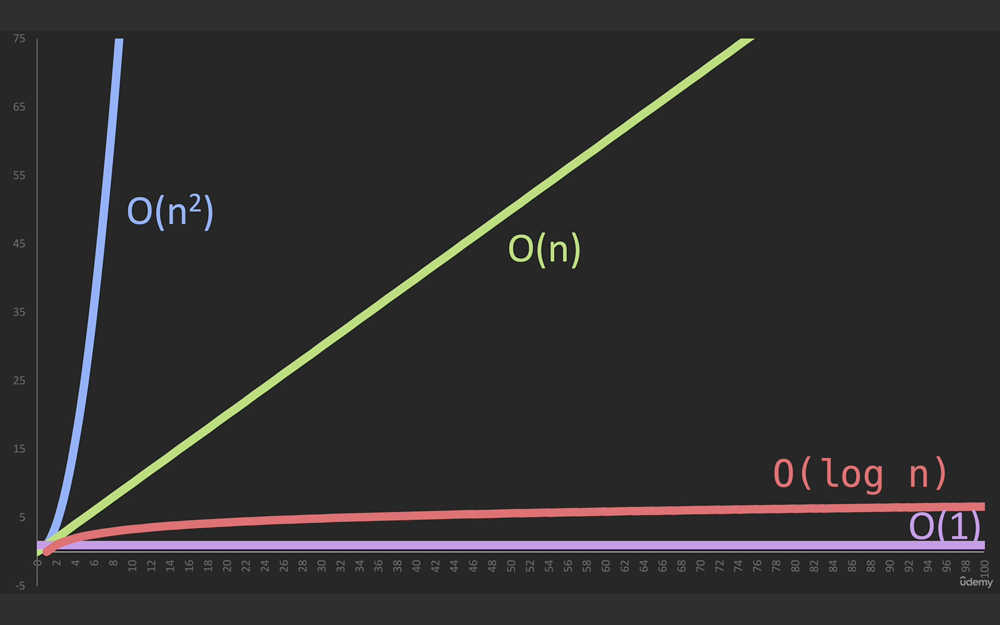

Big O Basic Concepts:
- O(1): Constant Time
    - Doesn't depend on the size of the data set.
    - Example: Accessing an array element by its index.
- O(log n): Logarithmic Time
    - Splits the data in each step (divide and conquer).
    - Example: Binary search.
- O(n): Linear Time
    - Directly propotinal to the data set size.
    - Example: Looping through an array.
- O(n log n): Logarithmic Time
    - Splits and sorts or searches data.
    - Example: Merge sort, quick sort.
- O(n^2): Polynomial Time
    - Nested loops for each power of n.
    - Example: Bubble sort (O(n^2)).

Omega (Ω) - Lower Bound
- What it means: Omega (Ω) describes the best-case scenario for an algorithm.
- In simple terms: It tells you the fastest an algorithm can run in the best
circumstances.

Theta (Θ) - Tight Bound
- In simple terms: It tells you what to generally expect in terms of time complexity.
- It is mostky Average case

Big O (O) - Upper Bound (Worst Case)
- What it means: Big O (O) describes the worst-case scenario for an algorithm.
- In simple terms: It tells you the slowest an algorithm can run in the worst
circumstances.

Useful Tips
- Best Case, Average Case, Worst Case
    - Consider all scenarios when analyzing.
- Drop Non-Dominant Terms
    - In O(n2 + n), focus on O(n2) as it will dominate for large n.
- Drop Constants
    - O(2n) simplifies to O(n).
- When we are measuring Big O , we are always measuring worst case.

Cheat Sheet for big O :
 - https://www.bigocheatsheet.com/

Graphical view of TCs: 
