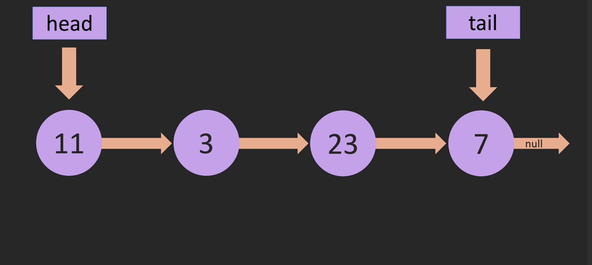

### Comparing arrays with LinkedList
- LinkedList dont have index as array
- Arrays are continues spaced in memory but linked list are randomly allocated in memory.

### LinkedList specs
LinkedList have `head` and `tail`
head : points towards the first time
tail: points towards the last time
Each Item in linkedList points to the next item

### Visual Represetation of LL

