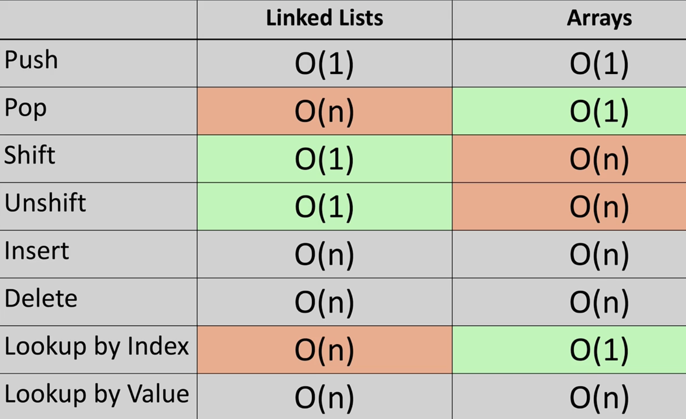

### Adding Node at the end 
TC: O(1)

### Removing Node from the end
TC: O(n)

### Adding Node at Start
TC: O(1)

### Remove Node from the start
TC: O(1)

### Inserting at any index 
TC: O(n)

### Remove node from any index
TC: O(n)

### Finding an Item by value
TC: O(n)

### Finding an item by index
TC: O(n)

### Comparison with Array:
